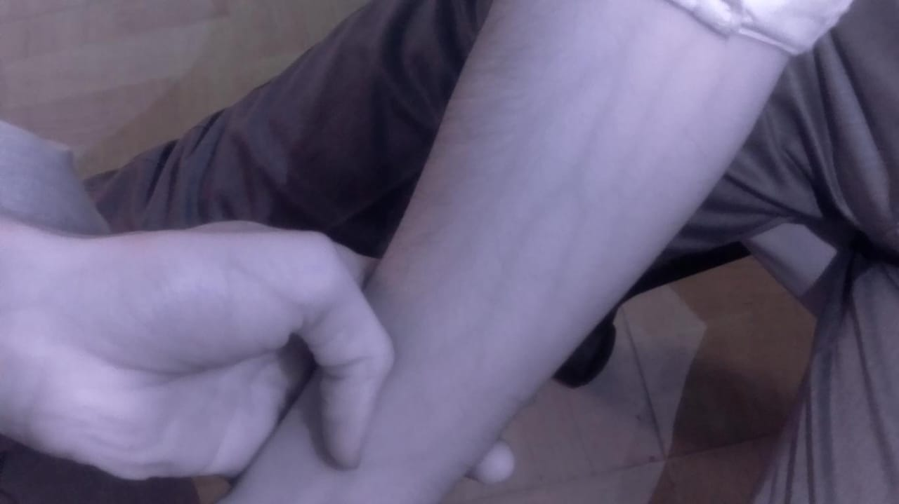

# 💡 Infrared Vein Mapping Using ESP32-CAM + OpenCV

A low-cost, real-time vein detection system that uses an **ESP32-CAM module** with an **IR LED light source** to capture vein-rich images of the hand. The captured images are then processed using **OpenCV in Python** to produce a clean vein map with prominent green overlays.

---

## 📸 Project Overview

This project aims to provide an affordable, portable, and real-time solution for mapping veins under the skin using:

- 📷 **ESP32-CAM** to capture IR-enhanced images
- 💡 **Infrared LED** to highlight subcutaneous veins
- 🧠 **Python + OpenCV** for image enhancement and vein detection

<p align="center">
   ➡️ 
</p>

---

## 🚀 Features

✅ Infrared image acquisition using ESP32-CAM  
✅ Real-time wireless transmission  
✅ Vein enhancement using CLAHE and Frangi filter  
✅ Edge detection and green overlay on vein paths  
✅ Low cost and scalable design  
✅ Ready for use in medical and biometric applications

---

## 🧪 Technologies Used

| Component       | Description                                   |
|----------------|-----------------------------------------------|
| 📷 ESP32-CAM     | Captures the infrared image over Wi-Fi         |
| 🔦 IR LED        | Illuminates veins for better visibility        |
| 🐍 Python        | Image processing pipeline                      |
| 📦 OpenCV        | Image enhancement, filtering & edge detection |
| 🔬 Scikit-Image  | Frangi filter for vesselness detection         |
| 💻 Streamlit (optional) | Simple web interface for demo           |

---

## 🧠 Image Processing Methods

### 1. CLAHE + Canny Edge Detection
- Enhances contrast using CLAHE
- Applies Canny edge detection
- Highlights detected edges in green

### 2. Frangi Filter (Scikit-Image)
- Specialized for detecting vessel-like structures
- Outputs a smooth and continuous vein map
- Best for IR images with low contrast

---

## 📂 Project Structure


---

## 🔗 Getting Started

### 1. 🔌 ESP32-CAM Setup
- Upload the provided ESP32 sketch using Arduino IDE
- Connect IR LED across GPIO
- Get the stream IP from serial monitor

### 2. 🐍 Python Environment

```bash
# Create virtual environment (optional)
python -m venv venv
source venv/bin/activate  # On Windows: venv\Scripts\activate

# Install dependencies
pip install -r requirements.txt
